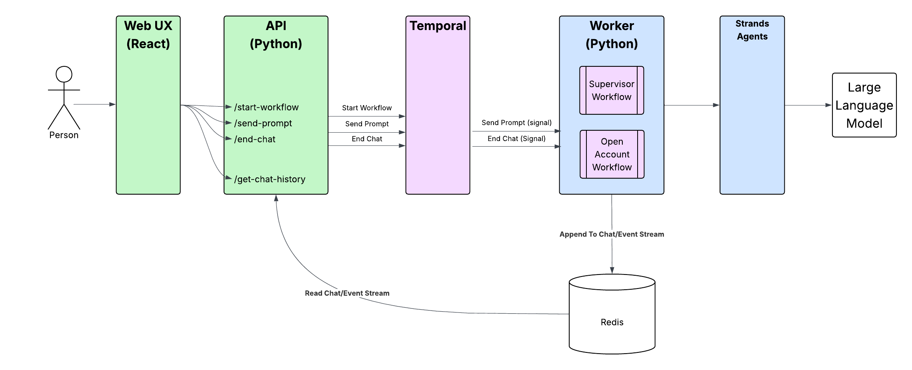

# Wealth Management Agent Example using Temporal + Strands

Demonstrates how to make the [Strands Agents](https://strandsagents.com/) wealth
management assistant **durable** by running it inside a
[Temporal](https://temporal.io) Workflow with the
[`StrandsPlugin`](https://docs.temporal.io/develop/python/integrations/strands-agents),
and driving it from a **React frontend** through a **FastAPI** backend (just like
the ADK version). The plugin routes every model invocation and tool call through
Temporal Activities, so each step is recorded in Workflow history and survives
crashes, restarts, and infrastructure failures.

The vanilla Strands (CLI) version of this example is located [here](../strands_supervisor/README.md).

## Application architecture



The React frontend uses adaptive polling (2s while awaiting the assistant, 5s
otherwise) to read new events from Redis via the API, giving real-time status
updates as the open-account child workflow progresses.

## What this demonstrates

| Temporal feature | Where |
|---|---|
| **Durable model + tool calls** | `TemporalAgent` in `workflows/supervisor_workflow.py` |
| **Agents as tools (nested)** | The supervisor delegates to `beneficiary_assistant` / `investment_assistant`; the investment agent delegates opening onward to `open_account_assistant` (`_make_*_assistant`) |
| **Tools as Activities** | `activities/` wrapped with `activity_as_tool` |
| **Child workflow** | The open-account agent starts `OpenInvestmentAccountWorkflow` |
| **Human approval gate** | `ApprovalHook` interrupts before `delete_beneficiary` / `close_investment`; UI shows Approve/Deny |
| **Human compliance gate** | The open-account child blocks on a `compliance_approved` Signal; UI shows "Approve Compliance" |
| **Continue-as-New** | The chat workflow carries `agent.messages` forward when history grows large |
| **Conversation history in Redis** | `EventStreamActivities` persist chat + status events the UI polls |

### A note on the agent topology

The ADK version uses ADK `sub_agents` with automatic LLM "transfer". Strands has
no transfer primitive, so this version uses the Strands
["agents as tools"](https://strandsagents.com/latest/documentation/docs/user-guide/concepts/multi-agent/agents-as-tools/)
pattern, nested two levels deep: a supervisor `TemporalAgent` delegates each request
to a specialized sub-agent — itself a `TemporalAgent` — exposed to it as a tool
(`beneficiary_assistant`, `investment_assistant`). The **investment agent** in turn
owns account-opening and delegates it onward to a third sub-agent,
`open_account_assistant` (see `_make_*_assistant` in
`workflows/supervisor_workflow.py`). The `StrandsPlugin` routes every model
invocation and tool call through Activities, so each sub-agent's work is durably
recorded in the workflow history. Delegation is one-directional (caller → specialist);
a specialist never calls back up.

The beneficiary and investment agents are rebuilt per request, but the
**open-account agent is persistent**: it is built once and reused across customer
turns (its message history is even carried across Continue-as-New) so it can hold
the open-account child-workflow ID while it walks the customer through KYC and waits
for compliance review — regardless of which agent invokes it, since it is keyed on
the workflow, not the caller. Opening an account is therefore owned by this dedicated
agent, which drives the durable `OpenInvestmentAccountWorkflow` child workflow, and
is reached via the investment agent rather than from the supervisor directly.

The scenarios are identical to the ADK demo; only the internal topology differs to
fit the Strands + Temporal integration. The CLI-only
[`strands_supervisor`](../strands_supervisor/README.md) version uses the same
"agents as tools" topology without the Temporal durability layer (there, opening an
account is a single synchronous tool inside the investment agent rather than a child
workflow).

## Prerequisites

* [uv](https://docs.astral.sh/uv/)
* [Node.js](https://nodejs.org/) 18+ and npm (for the React frontend)
* A [Gemini API key](https://aistudio.google.com/api-keys)
* [Temporal CLI](https://docs.temporal.io/cli#install)
* [Redis](https://redis.io/downloads/)

## Setup

From the project root:

```bash
uv sync
cp setgeminikey.example setgeminikey.sh   # then edit and paste your key
```

Start Redis and a local Temporal dev server in separate terminals:

```bash
redis-server
```

```bash
temporal server start-dev
```

Redis location can be overridden with `REDIS_HOST` / `REDIS_PORT`.

## Run the demo (local)

**1. Start the worker** (terminal 1, from the project root):

```bash
src/temporal_supervisor/startlocalworker.sh
```

**2. Start the API** (terminal 2):

```bash
src/api/startlocalapi.sh        # uvicorn on http://127.0.0.1:8000
```

**3. Start the React frontend** (terminal 3):

```bash
cd src/frontend
npm install      # first time only
npm start        # opens http://localhost:3000
```

Click **Start Chat**, then try client ID `123` or `234`.

### Human approval (delete / close)

When you ask to delete a beneficiary or close an investment account, the agent
interrupts and the UI shows an **Approve / Deny** banner. The status area also
reflects the pending approval. The agent resumes once you respond.

### Opening an account + compliance approval

When you open an investment account, the agent starts the child workflow and
walks you through KYC. The status area shows the progress; when the account is
**Waiting Compliance Review**, an **Approve Compliance** button appears. Click it
to send the `compliance_approved` Signal — the child workflow then creates the
account and reports `Complete`.

You can also approve compliance out-of-band from a terminal (the status text
includes the child workflow ID):

```bash
src/temporal_supervisor/sendcomplianceapproval.sh <child-workflow-id>
```

### Optional: CLI client

A command-line client is included for quick testing without the frontend/API:

```bash
src/temporal_supervisor/startchat.sh
```

## Run on Temporal Cloud

```bash
cp src/temporal_supervisor/setcloudenv.example setcloudenv.sh   # edit with your namespace + mTLS cert paths
# terminal 1:
source ./setcloudenv.sh && source ./setgeminikey.sh && uv run python src/temporal_supervisor/run_worker.py
# terminal 2:
src/api/startcloudapi.sh
# terminal 3:
cd src/frontend && npm start
```

`connect_client` reads `TEMPORAL_ADDRESS`, `TEMPORAL_NAMESPACE`, and the
`TEMPORAL_TLS_CLIENT_CERT_PATH` / `TEMPORAL_TLS_CLIENT_KEY_PATH` env vars.
